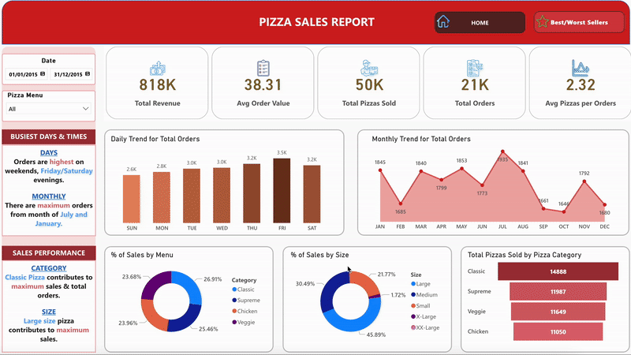

# Pizza Sales Data Analysis

 
## Overview

This project aims to analyze key performance indicators (KPIs) for a pizza sales dataset to gain insights into business performance. The goal is to calculate essential metrics that provide a comprehensive understanding of the sales trends, customer behavior, and operational efficiency.

---

## Tools & Technologies Used

- **Microsoft Excel **: For preliminary data analysis and visualization.
- **Microsoft SQL Server ** & **SQL Server Management Studio **: For data storage, extraction, and querying.
- **Power BI **: For creating interactive dashboards and visualizations.

---

## Features

- **Automated Calculations**: Accurate computation of key sales metrics.
- **Interactive Dashboards**: Comprehensive insights into sales trends, customer preferences, and operational efficiency using Power BI.
- **Actionable Insights**: Identifying the busiest sales periods, best-selling products, and average spending patterns.

---

## Usage

1. **Load the Pizza Sales Dataset into Microsoft SQL Server**
   - Create a new database in SQL Server.
   - Set up tables and import the dataset using the Import Data Wizard or SQL scripts.

2. **Clean, Transform, and Aggregate the Data**
   - Use SQL scripts to clean, transform, and aggregate the data, preparing it for analysis.

3. **Import the Processed Data into Power BI**
   - Connect Power BI to the SQL Server database.
   - Use **Power Query** to further transform and clean the data, such as renaming columns, filtering data, and creating calculated columns.

4. **Build Metrics and Visualizations with DAX**
   - Use **DAX (Data Analysis Expressions)** to create calculated measures and columns for KPIs like Total Revenue, Average Order Value, and Average Pizzas Per Order.

5. **Visualize and Explore Data**
   - Design interactive dashboards in Power BI to analyze KPIs, trends, and customer insights.

---

## Outputs
 
 
- A summary dashboard showing:
  - Total Revenue
  - Total Orders
  - Total Pizzas Sold
  - Average Order Value
  - Average Pizzas Per Order
- Monthly, daily, and categorical trends of pizza sales.
- Insights into customer preferences based on pizza size, category, and time of purchase.

---

## Author
Seunghyun Park
